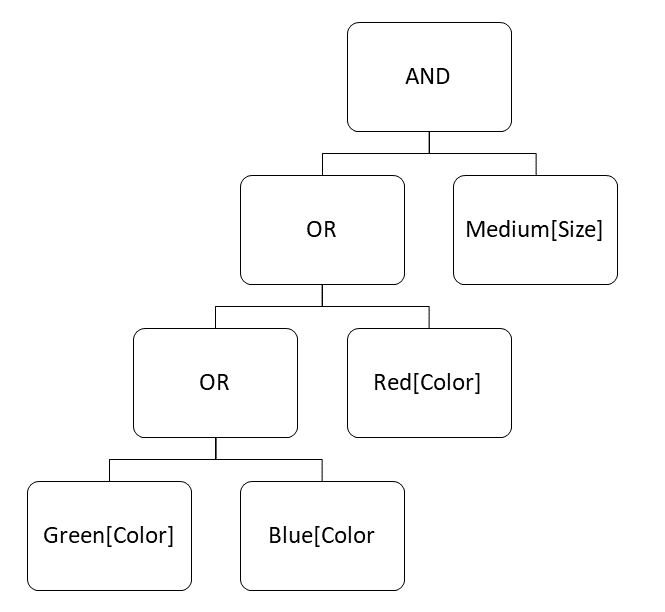

# String to filter object converter for MongoDB

With this module you can be able to make a MongoDB filter starting from a string that contains all arguments and operator.

Currently, the mongodb-filter-object-parser support 2 types of filter parser, search and advancedSearch;

The first one focused on queries that only want to get the documents containing the term/argument that was sent in any text field, and the advanced one offers high control on the query and needs syntax like value-field as argument.

## Search

### Supported use-cases

- Get all documents containing one word or more in all text fields of the document.
- Can be used logical operators like AND, OR & NOT.
- Use two or more words as one argument.

### Out of scope

- Advanced logic control with the use of parentheses.
- Make the query in a specific Field of the document.

### Syntax 

Only pass a String with all arguments and operators separated by a space like:

> (NOT) Value AND|OR|NOT value

###### Note: You can use multiple words as a single search term with double quotes: "search words"

Example:

> Not blue and tall

As result will obtain

```json
{
  "$text": {
    "$search": " -blue \"tall\""
  }
}
```

## Advanced search

### Supported use-cases

- Get documents containing the value defined in the field defined.
- Has more control at deep-level, as Binary tree expression (at this moment, tree can grow to the left).
- Can be used logical operators like AND & OR.
- Value is case insensitive.

### Out of scope

- Queries with range are not available support currently.

### Syntax

The syntax of the string will be like:

>(Value[Field]) or|and Value[Field]

*Note:* _At this time, the tree can only grow to the left, all new arguments should be added at the end_

Example: 

> ((Green[Color] or Blue[Color]) or Red[Color]) and Medium[Size]

Based on Binary Expression Tree the string will be passed to an object



As a result we'll obtain an object:

```json
{
  "$and": [
    {
      "Size": "Medium"
    },
    {
      "$or": [
        {
          "Color": "Red"
        },
        {
          "$or": [
            {
              "Color": "Green"
            },
            {
              "Color": "Blue"
            }
          ]
        }
      ]
    }
  ]
}
```

### Installation

> npm install mongodb-filter-object-parser


### Usage

~~~javascript
import { advancedSearchFilter, searchFilter } from "buildFilter";

const simpleString = 'Not blue and tall';
const simpleFilter = searchFilter(simpleString);

const advancedString = '(Blue[Color] or Red[Color]) and Medium[Size]';
const advancedFilter = advancedSearchFilter(string);

//use trough mongodb in a ODM as mongoose
const query = Collection.find(simpleFilter);
const query = Collection.find(advancedFilter);
~~~

### License

Copyright 2020 CCG UNAM

Permission is hereby granted, free of charge, to any person obtaining a copy of this software and associated documentation files (the "Software"), to deal in the Software without restriction, including without limitation the rights to use, copy, modify, merge, publish, distribute, sublicense, and/or sell copies of the Software, and to permit persons to whom the Software is furnished to do so, subject to the following conditions:

The above copyright notice and this permission notice shall be included in all copies or substantial portions of the Software.

THE SOFTWARE IS PROVIDED "AS IS", WITHOUT WARRANTY OF ANY KIND, EXPRESS OR IMPLIED, INCLUDING BUT NOT LIMITED TO THE WARRANTIES OF MERCHANTABILITY, FITNESS FOR A PARTICULAR PURPOSE AND NONINFRINGEMENT. IN NO EVENT SHALL THE AUTHORS OR COPYRIGHT HOLDERS BE LIABLE FOR ANY CLAIM, DAMAGES OR OTHER LIABILITY, WHETHER IN AN ACTION OF CONTRACT, TORT OR OTHERWISE, ARISING FROM, OUT OF OR IN CONNECTION WITH THE SOFTWARE OR THE USE OR OTHER DEALINGS IN THE SOFTWARE.
